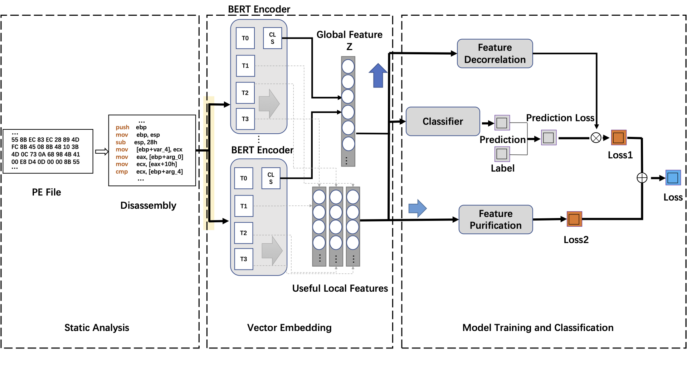

README

# EMC

A Semantic-Enhanced Malware Classification Framework with Robustness and Scalability.

## Update after Rebuttal

#### **Figure 1: The_overall_architecture_of_EMC**


#### **new Figure 4: The Processing Pipeline of Feature Decorrelation**


#### **new Figure 4: The Processing Pipeline of Feature Purification**


## Setup

* `IDA Pro`: >= 7.5
* `pytorch`==1.7.0 
* `cudatoolkit`=11.1
* `datasets`==1.18.3
* `transformers`==4.16.2
* `tensorboard`==2.8.0

## Dataset

The dataset `MalwareBazaar` `MalwareDrift` and label files `MalwareBazaar_Labels.csv` `MalwareBazaar_Labels.csv` used in this paper and code come from the following paper.

\[FSE2021\] [A Comprehensive Study on Learning-Based PE Malware Family Classification Methods.](https://dl.acm.org/doi/abs/10.1145/3468264.3473925)

Dataset:<https://github.com/MHunt-er/Benchmarking-Malware-Family-Classification>


## Experimental Settings

|    Model     | Optimizer | Learning Rate | Batch Size |                     Input Format                      |
| :----------: | :-------: | :-----------: | :--------: | :---------------------------------------------------: |
|  ResNet-50   |   Adam    |     1e-3      |     64     |                  224*224 color image                  |
|    VGG-16    |    SGD    |    5e-6**     |     64     |                  224*224 color image                  |
| Inception-V3 |   Adam    |     1e-3      |     64     |                  224*224 color image                  |
|    IMCFN     |    SGD    |    5e-6***    |     32     |                  224*224 color image                  |
|   CBOW+MLP   |    SGD    |     1e-3      |    128     |       CBOW: byte sequences; MLP: 256*256 matrix       |
|   MalConv    |    SGD    |     1e-3      |     32     |                  2MB raw byte values                  |
|    MAGIC     |   Adam    |     1e-4      |     10     |                         ACFG                          |
| Word2Vec+KNN |     -     |       -       |     -      | Word2Vec: Opcode sequences; KNN distance measure: WMD |
|     MCSC     |    SGD    |     5e-3      |     64     |                   Opcode sequences                    |
|     EMC      |   Adam    |     5e-5      |     12     |                Orient-opcode sequences                |

Early Stopping Patience: 10


## Useage (Update after Rebuttal)

Download Dataset

Download the MalwareBazaar_Labels.csv and MalwareDrift_Labels.csv from [Benchmarking-Malware-Family-Classification
](https://github.com/MHunt-er/Benchmarking-Malware-Family-Classification/tree/main/Datasets)

Download the samples from [MalwareBazaar website](https://bazaar.abuse.ch/api/) according to their hash names.


Disassembly (On Windows System)

Put the `auto_opcode.py`  `opcode_extraction.py` in the IDA Pro working directory. 

Put the raw malware binary files in the `pefile_dir` and run
```
python auto_opcode.py
```

Feature Process (On Linux System)

Put the output of `auto_opcode.py` in the `folder_path`(modify in opc_trans_sen.py) and run
```
python opc_trans_sen.py
```

Model Training and Validation (On Linux System)

Put the training and verification feature vectors processed by `opc_trans_sen.py` under path `traindir` `valdir`, and run
```
python main_FeatDe.py
```

